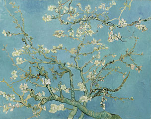
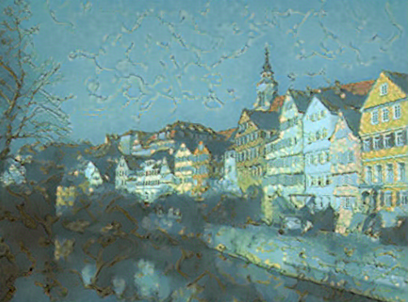

# Style-transfer
This is an assignment of the course Intro to Deep Learning on Udacity.

I re-implement image style transfer according to the paper [Image Style Transfer Using Convolutional Neural Networks](https://www.cv-foundation.org/openaccess/content_cvpr_2016/papers/Gatys_Image_Style_Transfer_CVPR_2016_paper.pdf) 

Style and content features are extracted by using a pretrained VGG network.
## Examples

  

